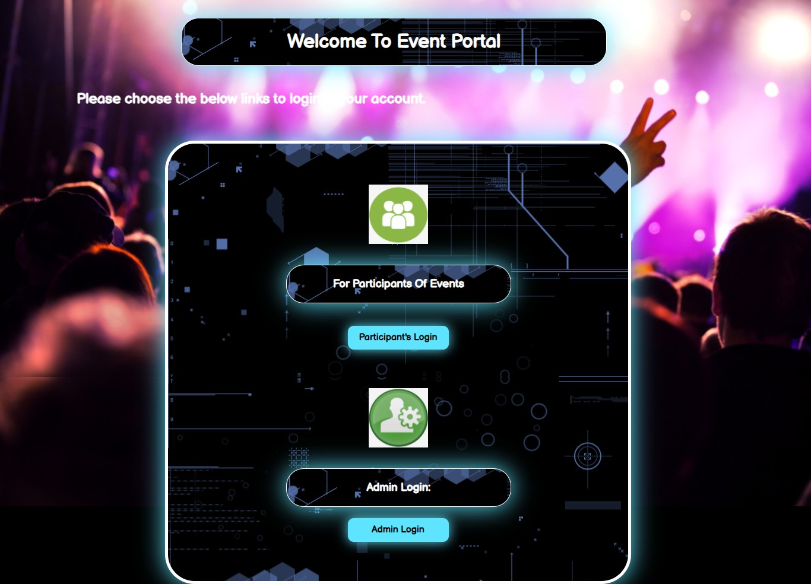
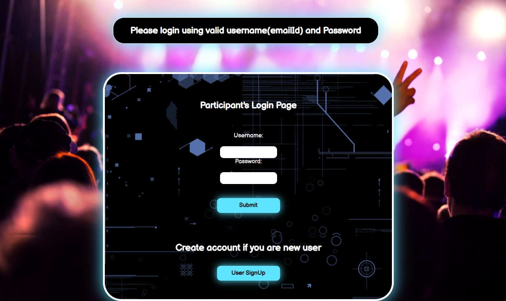
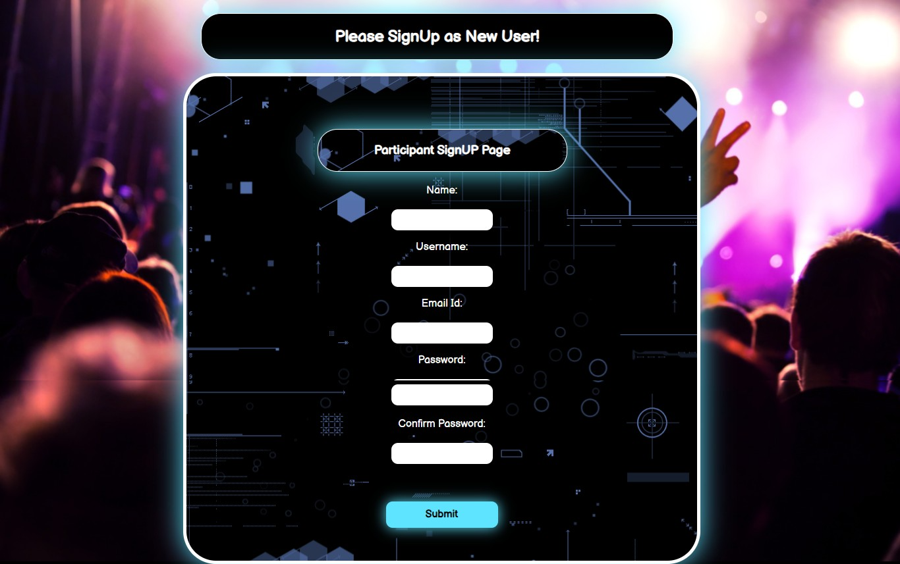
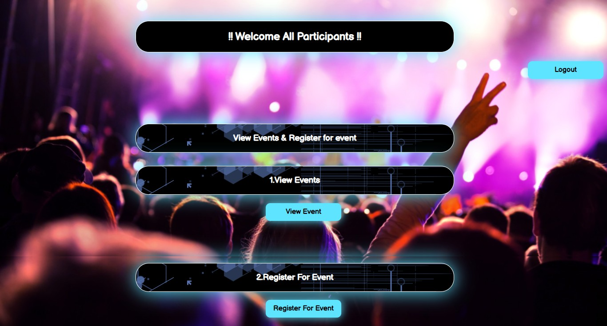
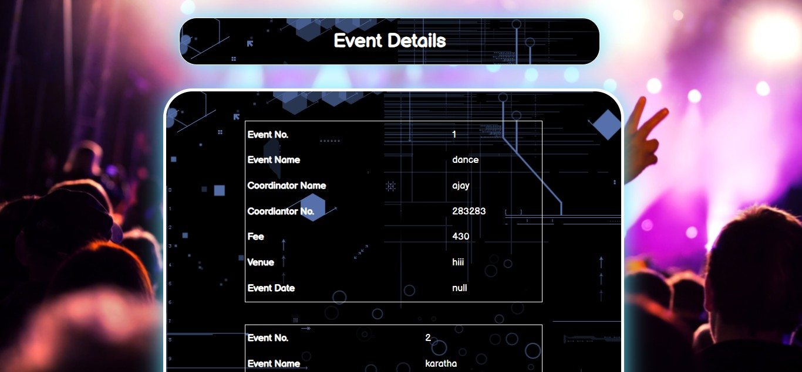
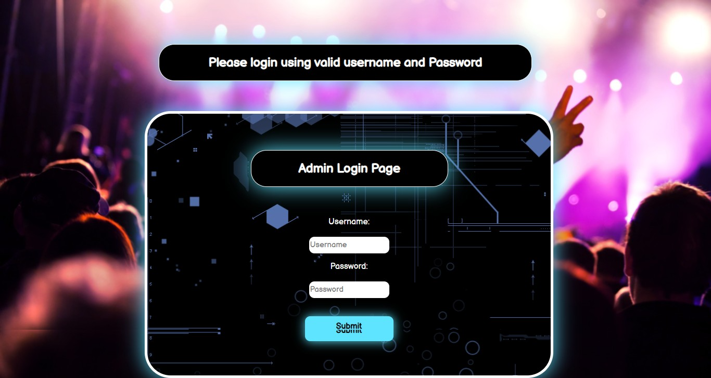
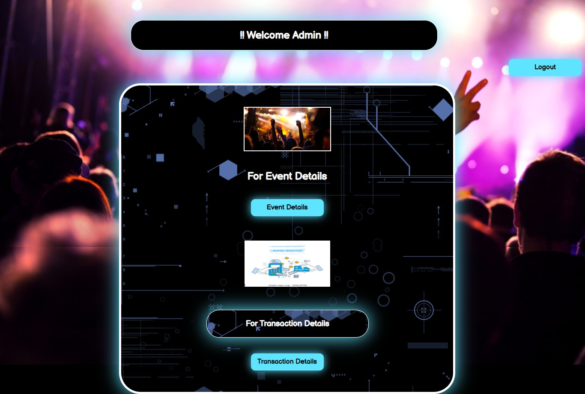

<h1>Event Manaement System</h1>

<h3>A web app designed to provide student to see the list of event that going to
held in college and able to participate in event that they like from the web app. For Admin to add new
event and see the student detail that participate in event.<h3>

  
    
  <h2>Index Page</h2>
  
    
  <h2>User Login Page</h2>
  
    
  <h2>User Signup Page</h2>
  
    
  <h2>User Panel Page</h2>
  
    
  <h2>Event List Page</h2>
  
    
  <h2>Event registration Page</h2>
  
    
  <h1></h1>
  
    
  <h2>Admin Login Page</h2>
  
    
  <h2>Admin Panel Page</h2>
  
    
  <h2>Admin Panel Page</h2>
  
  
